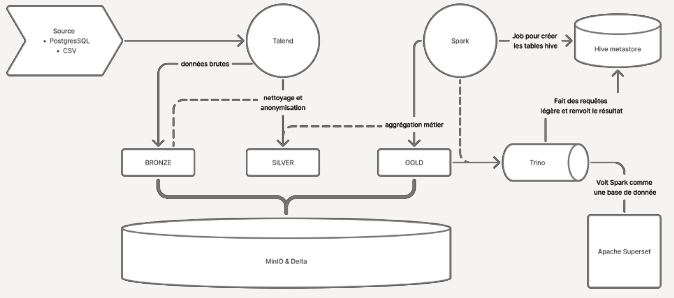
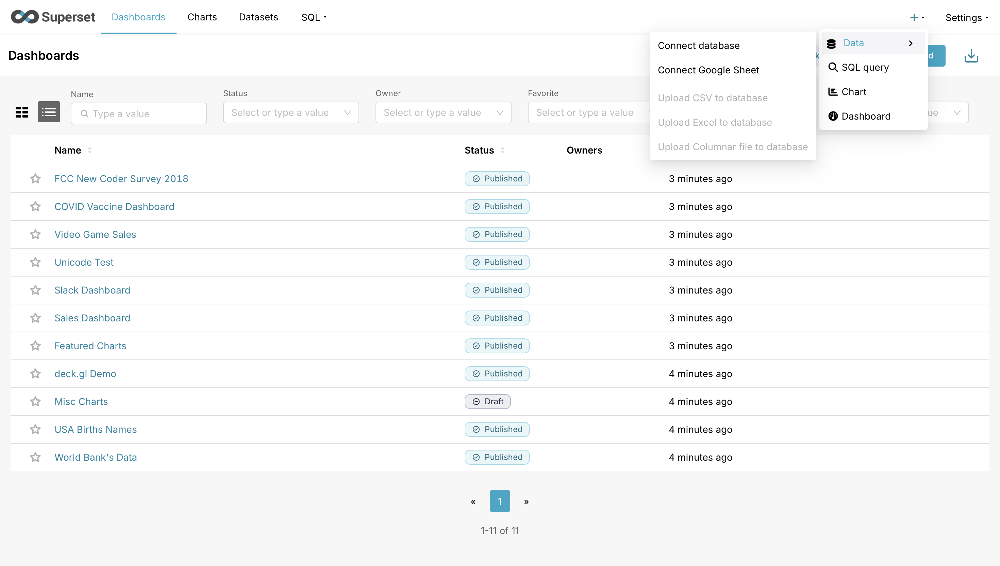

# Présentation du projet

Ce projet est une découverte du domaine Big Data appliqué au secteur de la santé. Il utilise plusieurs technologies pour ingérer, stocker, traiter et visualiser des données de santé.
Plutôt que d'utiliser une architecture "on-premise", ce projet se tourne vers une architecture lakehouse en utilisant des conteneurs Docker pour simuler un environnement cloud.

En ce qui concerne les technologies utilisées dans notre architecture, nous avons :

- **PostgreSQL** : pour le stockage relationnel des données sources.
- **PgAdmin** : pour la gestion de la base de données PostgreSQL via une interface web.
- **MinIO** : pour le stockage d'objets, simulant un data lake.
- **Delta Lake** : pour le stockage de données en format open-source optimisé pour les workloads Big Data.
- **Apache Spark** : pour le traitement distribué des données.
  - **Trino** : pour permettre aux outils BI de se connecter à Spark via JDBC/ODBC.
- **Apache Superset** : pour la visualisation et l'analyse des données.

Nous pouvons ainsi ingérer des données de santé dans PostgreSQL, les transférer vers MinIO, les traiter avec Spark en utilisant Delta Lake, et enfin visualiser les résultats avec Apache Superset.

---
Cette architecture permet de répondre aux besoins utilisateurs suivants :

- Taux de consultation des patients dans un établissement X sur une période de temps Y
- Taux de consultation des patients par rapport à un diagnostic X sur une période de temps Y
- Taux global d'hospitalisation des patients dans une période donnée Y
- Taux d'hospitalisation des patients par rapport à des diagnostics sur une période donnée
- Taux d'hospitalisation par sexe, par âge
- Taux de consultation par professionnel
- Nombre de décès par localisation (région) et sur l'année 2019
- Taux global de satisfaction par région sur l'année 2020

## Instruction pour installer et lier les environnement entre eux

### Remplir la base de données PostgreSQL avec les données fournies

*Pour remplir les données du fichier DATA2023 dans PostgresSQL.*

**Important :** Assurez-vous que le fichier DATA2023 est placé dans le répertoire `new_conf/data/DATA2023` avant de démarrer les conteneurs Docker.

1. Démarrer les conteneurs :
   `docker-compose up -d`

2. Restaurer la base de données :
   `docker exec postgres-db pg_restore -U postgres -d healthcare_data -v --no-owner --no-acl "/data/DATA2023"`

Alternative si le fichier DATA2023 est dans un sous-dossier :
`docker exec postgres-db pg_restore -U postgres -d healthcare_data -v --no-owner --no-acl "/data/DATA2023/BDD PostgreSQL/DATA2023"`

## Connecter Apache Superset à Trino
*Pour connecter Apache Superset à Trino afin de visualiser les données traitées par Spark.*

1. Accédez à l'interface web d'Apache Superset en ouvrant votre navigateur et en allant à l'adresse `http://localhost:8088`.

2. Connectez-vous avec vos identifiants (par défaut, admin/admin).
3. Cliquez sur l'icône "+" dans le menu latéral gauche, puis sélectionnez "Bases de données".

4. Remplissez le formulaire avec les informations suivantes :
   - **Nom** : Trino
   - **Type** : Druid
   - **URI** : `trino://admin@trino:8080/delta/healthcares`
   - **Utilisateur** : `admin`
   - **Mot de passe** : `admin`
1. Cliquez sur "Tester" pour vérifier la connexion, puis sur "Ajouter" pour enregistrer la base de données.
